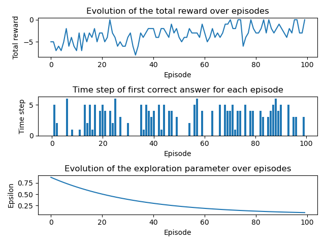

# rl_rule_learning

Implementation in DQN of a rule learning task introduced by Karl Frison for active learning. The reference to the paper is 
the following:  
>Karl J. Friston, Marco Lin, Chris D. Frith, Giovanni Pezzulo, J. Allan Hobson, and Sasha
Ondobaka. Active inference, curiosity and insight. Neural Computation, 29:2633–2683, 2017.

A DQN agent was trained over 100 episodes. The resulting learning plots is the following:  

